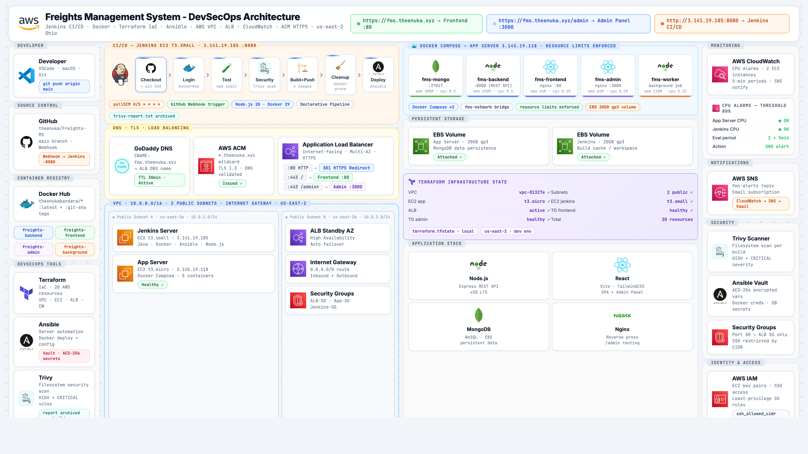
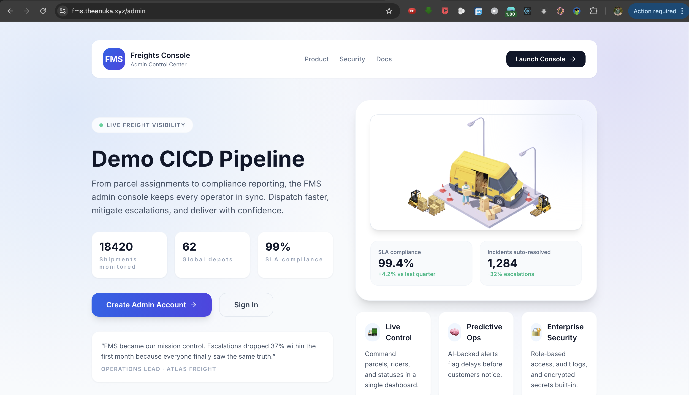
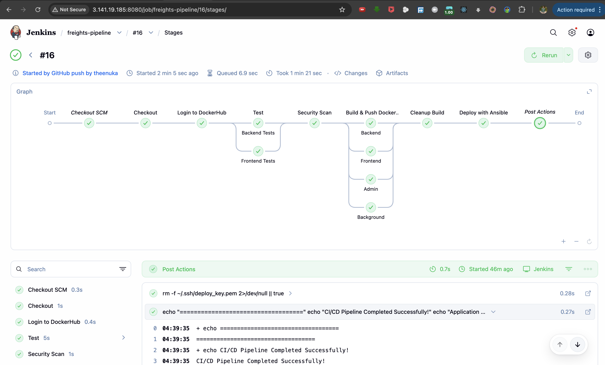
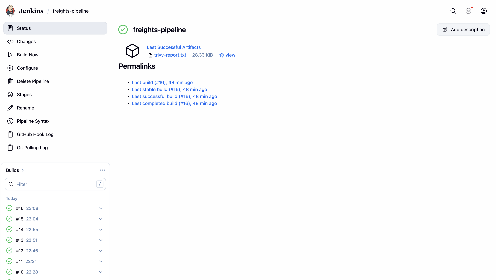
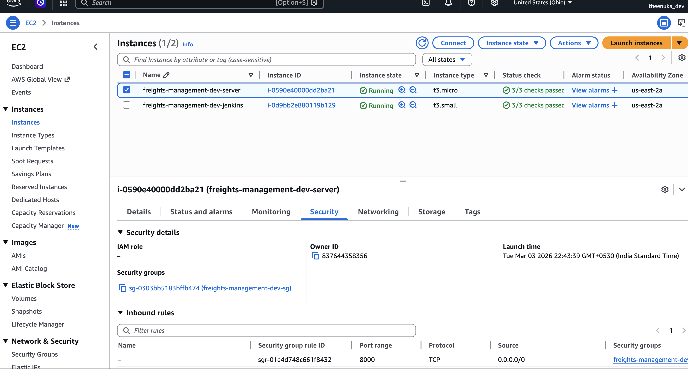
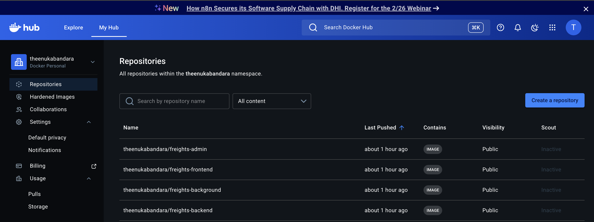

<div align="center">

<h1>Freights Management System</h1>
<p>Full-stack freight & parcel tracking platform with a complete DevSecOps pipeline on AWS</p>

[](https://fms.theenuka.xyz)
[](http://3.141.19.185:8080)
[](https://hub.docker.com/u/theenukabandara)
[](./terraform)
[](https://aws.amazon.com)

</div>

---

## Architecture



---

## Demo

> Click the thumbnail below to watch the full demo

[](https://github.com/theenuka/Freights-Management-System/raw/main/docs/demo.mp4)

---

## Overview

FMS is a full-stack logistics web application built to manage parcels from creation to delivery. Originally built as a 4th Semester Web Development project, it was extended in 5th Semester DevOps Engineering into a production-grade DevSecOps deployment on AWS.

| Layer | Path | Description |
|-------|------|-------------|
| Frontend | `Frontend/` | Customer portal — parcel tracking |
| Admin Panel | `Admin/` | Management dashboard — create parcels, manage users |
| Backend API | `Backend/` | REST API (Node.js + Express + MongoDB) |
| Background Worker | `BackgroundServices/` | Automated email notifications |

---

## DevSecOps Pipeline

Every `git push` to `main` triggers the full pipeline automatically:

```
GitHub Webhook
    → Jenkins (7 stages)
        → Checkout + git SHA tag
        → Login to Docker Hub
        → Test (npm audit — Backend + Frontend)
        → Security Scan (Trivy — HIGH/CRITICAL vulnerabilities)
        → Build & Push 4 Docker images
        → Cleanup (docker system prune)
        → Ansible Deploy to EC2
            → docker-compose up -d
            → ALB health check ✅
            → Live at https://fms.theenuka.xyz
```

### Pipeline Stages — Jenkins Blue Ocean



### Build History



---

## Infrastructure (Terraform — 20 AWS Resources)

| Resource | Details |
|----------|---------|
| VPC | 10.0.0.0/16 — custom network |
| Subnets | 2 public subnets (us-east-2a, us-east-2b) |
| EC2 — App Server | t3.micro · Docker Compose · 5 containers |
| EC2 — Jenkins | t3.small · CI/CD server |
| ALB | Internet-facing · path-based routing |
| ALB Listener | :80 → 301 HTTPS redirect |
| ALB Listener | :443 → frontend :80 / /admin* → admin :3000 |
| ACM Certificate | *.theenuka.xyz wildcard · TLS 1.3 |
| CloudWatch Alarms | CPU > 80% on both EC2s |
| SNS Topic | Email alerts on alarm |
| Security Groups | Port 80 restricted to ALB SG only |
| EBS Volumes | 20GB gp3 — MongoDB persistence + Jenkins workspace |

### EC2 Instances — AWS Console



---

## Docker — 5 Containers with Resource Limits

| Container | Image | Port | CPU | Memory |
|-----------|-------|------|-----|--------|
| fms-mongo | mongo | 27017 | 0.5 | 300M |
| fms-backend | theenukabandara/freights-backend | 8000 | 0.5 | 250M |
| fms-frontend | theenukabandara/freights-frontend | 80 | 0.25 | 64M |
| fms-admin | theenukabandara/freights-admin | 3000 | 0.25 | 64M |
| fms-worker | theenukabandara/freights-background | — | 0.25 | 128M |

### Docker Hub — 4 Public Repositories



---

## Tech Stack

**Application**
- Node.js + Express — REST API
- React + Vite + Tailwind CSS — Frontend & Admin SPA
- MongoDB + Mongoose — Database
- Nginx — Reverse proxy with `/admin` path routing
- JWT — Authentication
- Nodemailer — Background email notifications

**DevOps / Infrastructure**
- Jenkins — CI/CD (Declarative Pipeline, 7 stages)
- Docker + Docker Compose — Containerisation with resource limits
- Terraform — Infrastructure as Code (AWS provisioning)
- Ansible + Ansible Vault — Configuration management + AES-256 encrypted secrets
- Trivy — Security scanning (filesystem, HIGH/CRITICAL)
- AWS ALB — Load balancing + path-based routing
- AWS ACM — Wildcard SSL certificate
- AWS CloudWatch + SNS — Monitoring + alerting
- GoDaddy DNS — CNAME → ALB

---

## Security

- **Trivy** scans every build for HIGH and CRITICAL vulnerabilities — report archived as Jenkins artifact
- **Ansible Vault** encrypts all secrets at rest (Docker credentials, DB connection strings)
- **Security Groups** restrict port 80 to ALB SG only — app server not directly accessible
- **TLS 1.3** enforced via AWS ACM wildcard certificate
- **SSH** access restricted by CIDR variable in Terraform
- **Passwords** AES-encrypted at rest in MongoDB
- **JWT** tokens signed with secret, 10-day validity

---

## Project Structure

```
├── Jenkinsfile                  # 7-stage declarative pipeline
├── docker-compose.yml           # Local development compose
├── Backend/                     # Node.js REST API
├── Frontend/                    # React customer portal
├── Admin/                       # React admin dashboard
├── BackgroundServices/          # Email worker
├── ansible/                     # Ansible roles + Vault secrets
│   └── roles/
│       ├── app_deploy/          # Docker Compose deployment
│       └── jenkins/             # Jenkins server setup
├── terraform/                   # AWS infrastructure
│   ├── main.tf                  # EC2 instances + security groups
│   ├── vpc.tf                   # VPC + subnets + IGW
│   ├── alb.tf                   # ALB + target groups + listeners
│   ├── cloudwatch.tf            # CPU alarms + SNS
│   └── variables.tf
└── docs/
    ├── architecture-diagram.png
    └── screenshots/
```

---

## Local Setup

### Prerequisites
- Docker Desktop
- Node.js 20+

### Run locally with Docker Compose

```bash
git clone https://github.com/theenuka/Freights-Management-System.git
cd Freights-Management-System
cp .env.example .env        # fill in DB, JWT_SEC, PASS, EMAIL_USER, EMAIL_PASS
docker compose up --build
```

| Service | URL |
|---------|-----|
| Frontend | http://localhost:5173 |
| Admin | http://localhost:5174 |
| API | http://localhost:8000/api/v1 |

### Run without Docker

```bash
cd Backend && npm install && npm run dev
cd Frontend && npm install && npm run dev
cd Admin && npm install && npm run dev
cd BackgroundServices && npm install && npm start
```

---

## API Reference

Base URL: `/api/v1`

| Method | Endpoint | Description |
|--------|----------|-------------|
| POST | `/auth/register` | Register new user |
| POST | `/auth/login` | Login — returns JWT |
| GET | `/users` | List users (protected) |
| GET | `/parcels` | List parcels (protected) |
| POST | `/parcels` | Create parcel (admin) |
| PUT | `/parcels/:id` | Update parcel status |

---

## Live URLs

| Service | URL |
|---------|-----|
| Frontend | https://fms.theenuka.xyz |
| Admin Panel | https://fms.theenuka.xyz/admin |
| Jenkins | http://3.141.19.185:8080 |

---

## Troubleshooting

| Issue | Fix |
|-------|-----|
| 401 on login | Wrong `PASS` key — run `npm run reset-password` in Backend |
| Emails not sending | Set `EMAIL_USER` / `EMAIL_PASS` in `.env` |
| Port already in use | Dynamic port fallback handles this automatically |

---

> 5th Semester DevOps Engineering module project — University of Plymouth (NSBM Green University)
